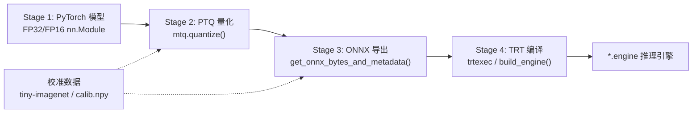
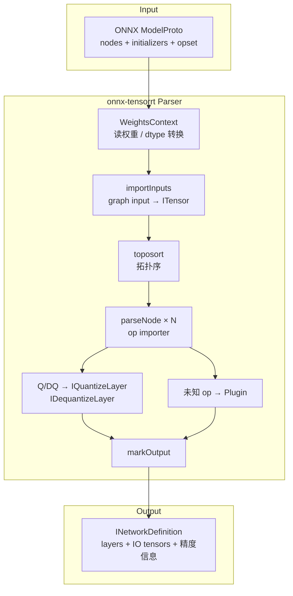
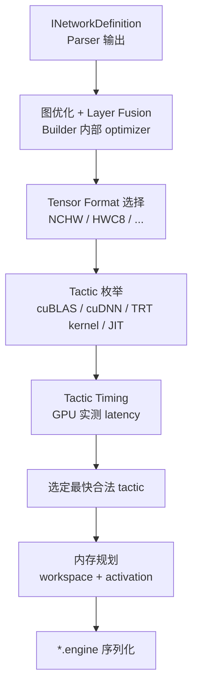
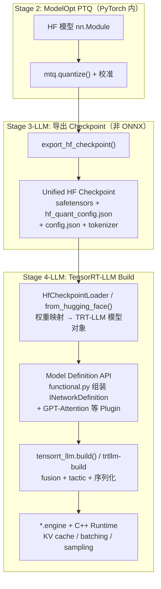
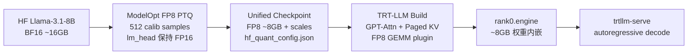
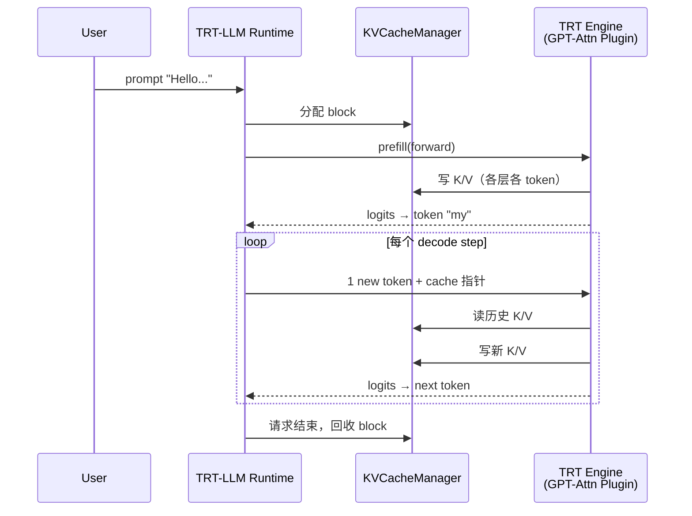

# PyTorch → Quantize → ONNX → TensorRT Engine 流程总结

本文档基于 `/home/zhangxa/trt` 目录下的代码，梳理 **PyTorch → 量化 → ONNX → TensorRT Engine** 的完整流程，说明各阶段输入输出及如何衔接。

---

## 一、目录里各仓库的角色

| 目录 | 作用 |
|------|------|
| `pytorch/` | PyTorch 框架源码；提供 `torch.onnx.export` 等导出能力 |
| `onnx/` | ONNX 格式规范与工具 |
| `onnx-tensorrt/` | **ONNX Parser**（`libnvonnxparser.so`）：把 ONNX 图解析成 `INetworkDefinition`；详见 [Stage 4.1](#stage-41onnx-tensorrt-parser-详解) |
| `TensorRT/` | TRT SDK；`IBuilder` 编译 engine；提供 `trtexec`、Plugin；详见 [Stage 4.2](#stage-42tensorrt-builder-详解) |
| `Model-Optimizer/` | **流程编排核心**：PyTorch PTQ、ONNX PTQ、导出、TRT 编译封装 |
| `TensorRT-LLM/` | LLM 专用部署路径（多数场景**不走 ONNX**，见第六节） |

---

## 二、端到端总览（以视觉模型为例）

Model-Optimizer 的 `examples/torch_onnx/torch_quant_to_onnx.py` 是最完整的 **PyTorch → Quantize → ONNX → Engine** 示例：



---

## 三、各阶段详解

### Stage 1：PyTorch 原始模型

**输入**

- 预训练模型，例如 timm 的 `vit_base_patch16_224`
- 典型 tensor 形状：`[batch, 3, 224, 224]`

**输出**

- `nn.Module`，权重为 FP32/FP16/BF16

**代码入口**

- `timm.create_model(...)` 或 HuggingFace `from_pretrained`

---

### Stage 2：Post-Training Quantization（PTQ）

**输入**

| 项 | 说明 |
|----|------|
| PyTorch 模型 | Stage 1 的 `nn.Module` |
| 量化配置 | 如 `mtq.FP8_DEFAULT_CFG`、`mtq.NVFP4_DEFAULT_CFG` |
| 校准数据 | 代表性样本（ViT 默认 512 张 ImageNet 子集） |
| `forward_loop` | 跑前向，收集各层 activation 的 amax/scale |

**过程**

1. `mtq.quantize(model, config, forward_loop)` 原地替换为带 quantizer 的模块
2. 校准数据过模型，计算 scale / amax
3. 针对 TRT 做兼容性修正（Conv2d 精度、4D tensor 的 DynamicQuantize 限制等）

**输出**

- **带 quantizer 的 PyTorch 模型**（仍是 PyTorch 对象，但已"假量化"/已标定）
- 各 quantizer 上挂有 `amax`、scale 等校准结果

**关键 API**

```python
import modelopt.torch.quantization as mtq

model = mtq.quantize(model, mtq.NVFP4_DEFAULT_CFG, forward_loop)
```

**TRT 兼容处理**（`torch_quant_to_onnx.py`）

- MXFP8/NVFP4 下 Conv2d 强制改为 FP8（TRT 对 Conv 只支持 FP8/INT8）
- 4D 输入的 LayerNorm 禁用 input quantizer（TRT DynamicQuantize 只支持 2D/3D）
- 首层 RGB Conv（`in_channels<=3`）禁用 input quantizer

---

### Stage 3：导出 ONNX

**输入**

| 项 | 说明 |
|----|------|
| 量化后的 PyTorch 模型 | Stage 2 输出 |
| dummy input | 如 `torch.randn([1,3,224,224])` |
| `weights_dtype` | 通常 `"fp16"` |
| opset | 默认 **20** |

**过程**（`get_onnx_bytes_and_metadata()`，`modelopt/torch/_deploy/utils/torch_onnx.py`）

1. **`torch.onnx.export`**：把计算图导出为 ONNX
2. **图优化**：shape inference、BatchNorm 清理等
3. **`quantize_weights()`**：根据 PyTorch 量化类型插入 **Q/DQ 节点**
   - INT8 → `QuantizeLinear` / `DequantizeLinear`
   - FP8 → `TRT_FP8QuantizeLinear` / `TRT_FP8DequantizeLinear`
   - NVFP4/MXFP8 → TRT 自定义算子 + block scale
4. **FP16 转换**：非 Q/DQ 部分转 FP16，并做 Cast 折叠以适配 TRT fusion
5. **TRT 后处理**：去除冗余 Cast、修正 zero scale 等

**输出**

- **`*.onnx` 文件**（可能带 external data）
- 图结构：**Q → DQ → MatMul/Conv/...** 的显式量化 ONNX
- 输入/输出 dtype 与 shape 与 dummy input 一致

**关键代码**

```python
from modelopt.torch._deploy.utils import get_onnx_bytes_and_metadata

onnx_bytes, _ = get_onnx_bytes_and_metadata(
    model=quantized_model,
    dummy_input=(input_tensor,),
    weights_dtype="fp16",
    model_name=model_name,
)
```

---

### Stage 4：TensorRT Engine 编译

Stage 4 分为两步：**Parser**（`onnx-tensorrt`）和 **Builder**（`TensorRT` SDK）。Parser 负责语义翻译，Builder 负责性能编译。

```
*.onnx  ──►  onnx-tensorrt (IParser)  ──►  INetworkDefinition  ──►  IBuilder  ──►  *.engine
```

**输入**

| 项 | 说明 |
|----|------|
| 量化 ONNX | Stage 3 的 `*.onnx` |
| 编译参数 | `precision=stronglyTyped`（推荐）、optimization level 等 |
| 可选 | timing cache、custom plugin `.so` |

**过程（Builder 阶段）**

1. **ONNX Parser**（`onnx-tensorrt`）解析 ONNX → `INetworkDefinition`（见 [Stage 4.1](#stage-41onnx-tensorrt-parser-详解)）
2. **TRT Builder** 做图优化、layer fusion、format 选择、tactic 搜索与 kernel 选定（见 [Stage 4.2](#stage-42tensorrt-builder-详解)）
3. 对 Q/DQ 图使用 **stronglyTyped** 模式，保留 FP8/INT4 等精度语义
4. 序列化为 engine 二进制

**输出**

- **`*.engine`**（或内存中的 engine bytes）
- 可直接 `execute_async_v3` 推理

**方式 A：`trtexec` CLI**（`torch_quant_to_onnx.py --trt_build`）

```bash
trtexec --onnx=model.onnx --stronglyTyped --builderOptimizationLevel=4
```

**方式 B：Python API**（`examples/onnx_ptq/evaluate.py`）

```python
from modelopt.torch._deploy._runtime import RuntimeRegistry
from modelopt.torch._deploy.device_model import DeviceModel
from modelopt.torch._deploy.utils import OnnxBytes

deployment = {"runtime": "TRT", "precision": "stronglyTyped"}
onnx_bytes = OnnxBytes(onnx_path).to_bytes()
client = RuntimeRegistry.get(deployment)
compiled_model = client.ir_to_compiled(onnx_bytes, compilation_args)
device_model = DeviceModel(client, compiled_model, metadata={})
```

底层 `TRTLocalClient._ir_to_compiled()` → `build_engine()` → 内部调用 `trtexec` 或 TRT Python Builder。

---

### Stage 4.1：onnx-tensorrt Parser 详解

`onnx-tensorrt/` 产出 **`libnvonnxparser.so`**，C++ API 在 `NvOnnxParser.h`。它处在 Builder 之前：把 ONNX 计算图翻译成 TRT 的 `INetworkDefinition`，**不做** kernel 选择、tactic 搜索、engine 序列化。

#### 对外 API（`IParser`）

| API | 作用 |
|-----|------|
| `parse()` / `parseFromFile()` | 读 ONNX → 填充 `INetworkDefinition` |
| `supportsOperator()` | 查询某 ONNX op 是否可能有 importer |
| `supportsModelV2()` | 不建网，探测整图/子图是否可支持 |
| `loadModelProto()` + `loadInitializer()` + `parseModelProto()` | 分步解析，允许用户注入自定义 initializer |
| `setBuilderConfig()` | 配合 DLA capability 检查 |
| `setFlags()` | 控制 InstanceNorm 实现、UINT8 非对称量化、DLA 适配等 |
| `IParserRefitter` | 从 ONNX 权重 refit 已有 engine（不重新 parse 整图） |

典型用法：

```cpp
auto* parser = nvonnxparser::createParser(*network, logger);
parser->parseFromFile("model.onnx", verbosity);
// 之后 IBuilder 编译 network
```

#### 核心入口：`ModelImporter::importModel()`

源码 `onnx-tensorrt/ModelImporter.cpp`，大致 7 步：

1. 校验并记录 **opset**（要求 `ai.onnx` ≥ opset 7；TRT 11.0 支持 opset 9–24）
2. `logModelInfo()` — 记录 IR version、producer 等
3. 预注册 graph output 名字（避免重名）
4. `importLocalFunctions()` — 导入 ONNX Local Function
5. `importInputs()` — graph input → `network->addInput()` 创建 `ITensor`
6. `parseGraph()` — 拓扑序逐节点 import
7. `markOutput()` — 标记 graph output

#### 子系统分工

**（1）权重与 Initializer（`WeightsContext`）**

- 遍历 `graph.initializer`，`convertOnnxWeights()` → TRT `ShapedWeights`
- dtype 转换/降级：`DOUBLE→FLOAT`、`INT64→INT32`；普通 `UINT8→INT32`（Q/DQ 路径除外）
- 支持 **external data** 权重、用户 `loadInitializer()` 注入
- 临时权重（如 BatchNorm 合并 scale/bias）统一生命周期管理

**（2）张量抽象（`TensorOrWeights`）**

图中每个名字对应：
- **`ITensor*`** — 动态/中间结果
- **`ShapedWeights`** — 编译期常量

Importer 在 `ctx->tensors()[name]` 里维护 name → tensor/weights 映射。

**（3）图遍历（`parseGraph`）**

```text
import initializers → toposort（含 If/Loop/Scan 子图隐式依赖）
  → 对每个 node：
       parseNodeStaticCheck()  // 静态合法性
       parseNode()             // 真正 import
       checkDLASupport()       // 若开启 DLA flag
```

**（4）算子分发（`parseNode`）**

优先级：

1. 内置 importer — `onnxOpImporters.cpp` 中 `DEFINE_BUILTIN_OP_IMPORTER`（100+ 算子，见 `docs/operators.md`）
2. ONNX Local Function — `LocalFunctionImporter`
3. 未知 op / 自定义 op — `FallbackPluginImporter`（TensorRT Plugin registry）
4. `kENABLE_PLUGIN_OVERRIDE` 时 plugin 可覆盖标准 ONNX op

每个 importer 负责：读 attributes → 校验输入 shape/dtype → 创建 TRT Layer（`addConvolutionNd`、`addMatrixMultiply` 等）→ `registerLayer()` → 输出写回 `ctx->tensors()`。

复杂控制流有专门 helper：`LoopHelpers`（Loop→`ILoop`）、`ConditionalHelpers`（If→`IIfConditional`）、`RNNHelpers`、`AttentionHelpers`。

#### 量化 Q/DQ 节点的专门处理

量化 ONNX 的核心映射在 `QuantDequantLinearHelper()`（`onnxOpImporters.cpp`）：

| ONNX Op | TRT Layer |
|---------|-----------|
| `QuantizeLinear` | `addQuantize()` → `IQuantizeLayer` |
| `DequantizeLinear` | `addDequantize()` → `IDequantizeLayer` |
| `TRT_FP8QuantizeLinear` / `TRT_FP8DequantizeLinear` | 同上，dtype=FP8 |
| `TRT_INT4QuantizeLinear` / `TRT_INT4DequantizeLinear` | 同上，dtype=INT4 |
| `TRT_MXFP8QuantizeLinear` / `TRT_MXFP8DequantizeLinear` | block 量化 + E8M0 scale |
| `TRT_MXFP8DynamicQuantize` | `addDynamicQuantize()` |
| `TRT_FP4DynamicQuantize` | `addDynamicQuantizeV2()` |

Q/DQ import 时 Parser 的具体工作：

1. 校验 data + scale 输入；scale 系数必须全为正
2. scale/zero_point 若是 initializer → 建 `IConstantLayer`；若是动态 tensor → 直连 layer input
3. 创建 `IQuantizeLayer` / `IDequantizeLayer`，设置 `axis`
4. **stronglyTyped** 网络下保留 FP8/INT4 等量化语义（opset < 19 时可能对 scale 做 Cast 对齐）

Parser **不会重新校准 scale**——只把 ONNX 里已有的 Q/DQ 语义忠实映射到 TRT 网络。scale 来自 Stage 2/3（Model-Optimizer）。

> 标准 ONNX `DynamicQuantizeLinear` 不被直接支持；Model-Optimizer 导出 `TRT_MXFP8DynamicQuantize` 等 TRT 自定义 op 替代。

#### Custom Op / Plugin

Model-Optimizer 导出的 `TRT_*` 算子（如 `TRT_FP8QuantizeLinear`、`TRT_QuantizedAttention`）通过 **TensorRT Plugin** 接入：

- 已注册 Plugin → `FallbackPluginImporter` 创建 `IPluginV2/V3` layer
- `getUsedVCPluginLibraries()` 返回 version-compatible engine 需序列化的 plugin `.so` 列表
- 自定义 schema 见 `onnx-tensorrt/docs/TRT_custom_ops.md`

#### Parser 与 Builder 的职责边界

| Parser 做 | Builder 做 |
|-----------|-----------|
| ONNX op → TRT layer 映射 | Layer fusion（如 Q-DQ-MatMul 融合） |
| 静态 shape 推断（能推则推） | 动态 shape profile 选择 |
| dtype / axis 语义保留 | Tactic 搜索、选最快 kernel |
| 加载权重到 network | 内存规划、workspace 分配 |
| Plugin layer 插入 | 序列化为 `.engine` |

量化模型尤其依赖 Builder 的 **Q/DQ fusion**（如 `DQ → MatMul → Q` 合成 INT8/FP8 GEMM）；Parser 只负责把 Q/DQ 节点正确放进 network。

#### Parser 数据流



**一句话**：Parser = 把 ONNX 声明式计算图逐节点、逐权重翻译成 TRT 可编译的网络定义；Builder = 在此基础上做融合、选 kernel、生成 engine。

---

### Stage 4.2：TensorRT Builder 详解

Parser 产出的是 **逻辑网络**（`INetworkDefinition`：层、张量、精度约束）。Builder（`IBuilder::buildSerializedNetwork()`）在此基础上做 **性能编译**，核心三件事是：**layer fusion**、**format/tactic 枚举**、**tactic 实测选型**。最终输出序列化 engine（`.engine` / `.plan`）。

#### 在整条链路中的位置



> **注意**：TRT **运行时只反序列化 engine**，不解析 ONNX。`trtexec --onnx=...` 内部是先 Parser 再 Builder，两步合一。

#### Builder 编译阶段概览

| 阶段 | 做什么 | 典型产物/结果 |
|------|--------|---------------|
| **1. 图优化 / Fusion** | 合并可融合的层序列，减少 kernel launch 与中间读写 | 如 Conv+Bias+ReLU、DQ+MatMul+Q |
| **2. Format 选择** | 为每层输入/输出选 tensor layout（linear、vectorized 等） | 影响哪些 tactic 可用 |
| **3. Tactic 枚举** | 列出该层所有合法实现（不同 kernel、tile、算法） | 候选集可能很大 |
| **4. Tactic Timing** | 在目标 GPU 上实测各 tactic 耗时 | 写入 **Timing Cache** |
| **5. Tactic 选定** | 在满足精度/约束前提下选最快 tactic | 固化进 engine plan |
| **6. 内存规划** | 分配 workspace、activation 复用 | `memPoolSize=workspace:N` |
| **7. 序列化** | 把 plan + 权重 + 选定 tactic 写入二进制 | `*.engine` |

---

#### 1. Layer Fusion（层融合）

Fusion 发生在 **Builder 内部优化器**，不在 Parser 阶段。Parser 只按 ONNX 节点建层；Builder 会尝试把相邻、语义兼容的层 **合成一个 fused kernel**。

**常见融合模式**

| 模式 | 说明 |
|------|------|
| **Conv + Bias + Activation** | 单 kernel 完成卷积、偏置、ReLU/GELU 等 |
| **DQ + MatMul/Gemm + Q** | 量化推理的核心：反量化→矩阵乘→再量化，合成 **INT8/FP8 GEMM** |
| **Scale + ElementWise** | BatchNorm 等已折叠为 Scale 后可与 Add/Mul 融合 |
| **Attention fused kernel** | `IAttention` 默认尝试单一 fused attention kernel（见 `NvInfer.h` 注释） |
| **Plugin 融合** | 部分 custom plugin 可与前后层融合（取决于 plugin 声明） |

**与量化 ONNX 的关系**

Stage 3 导出的 Q/DQ 图结构 **直接决定** 哪些融合能发生。Model-Optimizer 在导出时会刻意调整 Q/DQ 位置（如 FP8 MHA 共享 Q/DQ、LayerNorm output quantizer），目的就是满足 TRT 的 **Q/DQ fusion pattern**。

典型有效 pattern（ViT/LLM 常见）：

```text
DQ(weight) → MatMul ← DQ(activation)     →  融合为 Quantized GEMM
DQ → Conv ← DQ                           →  融合为 Quantized Conv
```

若 Q/DQ 之间插入了 TRT 无法穿透的 op（某些 Cast、非标准 layout），融合会断开，性能下降。

**如何观察 fusion 结果**

- `trtexec --verbose` 构建日志会打印 fusion 与 layer 信息
- [trex](TensorRT/tools/experimental/trt-engine-explorer/) / `IEngineInspector`：engine plan 里 **被融合的 intermediate tensor 不再单独出现**
- `network.markUnfusedTensorsAsDebugTensors()` 可标记未融合 tensor 用于调试（`NvInfer.h`）

---

#### 2. Kernel 选择与 Tactic 概念

在 TRT 术语里，**Tactic** = 某一层的 **一种具体实现方案**，包括但不限于：

- 使用 cuBLAS / cuBLASLt / cuDNN 中的哪个算法
- TRT 内置 custom kernel（含 INT8/FP8/FP4 Tensor Core 路径）
- **JIT 编译** 的动态 kernel（`TacticSource::kJIT_CONVOLUTIONS`）
- Edge-mask convolution 等专用实现（`kEDGE_MASK_CONVOLUTIONS`，用显存换性能）
- Plugin 提供的 kernel

每一层往往有 **多个 tactic 候选**；Builder 的任务是在候选中选出 **合法且最快** 的一个。

**Tactic Sources**（`NvInferRuntime.h` `TacticSource` 枚举，可通过 `IBuilderConfig::setTacticSources()` 开关）：

| Source | 含义 |
|--------|------|
| `kEDGE_MASK_CONVOLUTIONS` | 基于 edge mask 表的卷积 tactic（额外显存，默认开启） |
| `kJIT_CONVOLUTIONS` | 源码 JIT 融合卷积 tactic（build 更慢，默认开启） |

`trtexec` 对应参数：`--tacticSources=+JIT_CONVOLUTIONS` / `-EDGE_MASK_CONVOLUTIONS`。

**Timing Cache 里存什么**

每个 cache entry（`TimingCacheKey` → `TimingCacheValue`）记录：

- **`tacticHash`**：被选中的 tactic 哈希
- **`timingMSec`**：该 tactic 在目标 GPU 上的实测耗时（ms）

见 `NvInfer.h` 中 `TimingCacheValue` 定义。下次 build 相同/相似子图时可 **跳过重复 benchmark**，显著缩短 build 时间。

---

#### 3. Tactic 搜索（Tactic Search / Timing）

Tactic 搜索 = Builder 在 GPU 上 **benchmark 候选 tactic** 并选最优的过程。

**`builderOptimizationLevel`（0–5）** 控制搜索深度（`IBuilderConfig::setBuilderOptimizationLevel()`，`NvInfer.h` 官方说明）：

| Level | 行为 |
|-------|------|
| **0** | 最快 compile：禁用动态 kernel 生成，**第一个跑通的 tactic 就用**；**不使用 timing cache** |
| **1** | 启发式排序，只测 top 部分候选 |
| **2** | 启发式排序，只测最快的若干候选 |
| **3** | **默认**：启发式判断用静态预编译 kernel 还是动态编译 kernel |
| **4** | **总是编译动态 kernel** |
| **5** | 总是编译动态 kernel，并与静态 kernel 对比选优 |

本仓库 Model-Optimizer 对低比特模式（INT8/FP8/INT4/`stronglyTyped`）默认用 **level 4**：

```219:220:Model-Optimizer/modelopt/torch/_deploy/_runtime/tensorrt/engine_builder.py
        opt_level = "4" if _is_low_bit_mode(trt_mode) else builder_optimization_level
        cmd += _get_trtexec_params(engine_path, opt_level, timing_cache_path, verbose=verbose)
```

`torch_quant_to_onnx.py --trt_build` 同样传 `--builderOptimizationLevel=4`。

**Timing Cache 用法**

| 机制 | 说明 |
|------|------|
| `--timingCacheFile=cache.bin` | 加载已有 cache；build 结束可写回 |
| `--noBuilderCache` | 禁用 cache（等同 `BuilderFlag::kDISABLE_TIMING_CACHE`） |
| `ITimingCache::combine()` | 合并多机/多次 build 的 cache（同 TRT 版本；跨 GPU 需谨慎） |
| `kERROR_ON_TIMING_CACHE_MISS` | cache 中找不到某 tactic 时直接报错（CI 确定性 build） |

> **注意**：即使用相同 timing cache，在 **非 stronglyTyped** 模式下 rebuild 可能选出不同 tactic，engine 仍正确但性能/数值路径可能略有差异（见 `ITimingCache` 文档 warning）。

**动态 Shape 的影响**

若输入有动态维度，需配置 **Optimization Profile**（min/opt/max shape）：

```bash
trtexec --onnx=model.onnx \
  --minShapes=input:1x3x224x224 \
  --optShapes=input:8x3x224x224 \
  --maxShapes=input:16x3x224x224
```

Builder 会在 profile 范围内对 tactic 做 timing；**opt shape** 是 benchmark 的参考点，直接影响所选 kernel。

---

#### 4. 关键 `IBuilderConfig` 参数

| 参数 | 作用 | 本仓库典型用法 |
|------|------|----------------|
| **`--stronglyTyped`** | Network 创建时设 `kSTRONGLY_TYPED`；严格按层 dtype 执行，量化模型 **必开** | `evaluate.py`、`torch_quant_to_onnx.py` |
| **`--fp16` / `--fp8` / `--int8` / `--int4` / `--best`** | 全局精度 hint（与 stronglyTyped 配合方式不同） | `TRT_MODE_FLAGS` in `constants.py` |
| **`--builderOptimizationLevel=N`** | tactic 搜索深度 | 量化默认 **4** |
| **`--timingCacheFile=...`** | 复用/更新 timing cache | `evaluate.py --timing_cache_path` |
| **`--memPoolSize=workspace:N`** | builder workspace 上限（MiB） | OOM 时调小；默认 Model-Optimizer 256MB |
| **`--tf32`** | FP32 矩阵乘可用 TF32 Tensor Core（默认开启） | 非量化 FP32 模型 |
| **`--tacticSources=...`** | 开关 JIT / edge-mask 等 tactic 来源 | 缩小搜索空间可加速 build |
| **`--staticPlugins=...`** | 加载 custom plugin `.so` | TRT custom op ONNX |
| **`setProfilingVerbosity(kDETAILED)`** | engine inspector 输出层/tactic 详情 | 调试 fusion |

Python 等价写法（摘自 `TensorRT/documents/import_workflows.md`）：

```python
config = builder.create_builder_config()
config.set_memory_pool_limit(trt.MemoryPoolType.WORKSPACE, 4 << 30)
config.set_builder_optimization_level(4)
serialized = builder.build_serialized_network(network, config)
```

---

#### 5. 量化模型的 Builder 特殊逻辑

对 Stage 3 产出的 Q/DQ ONNX，Builder 阶段额外关注：

1. **stronglyTyped**：Parser 映射的 `IQuantizeLayer`/`IDequantizeLayer` dtype 不会被 Builder “优化掉”成 FP16。
2. **Q/DQ Fusion**：`DQ → MatMul → Q` 等模式合成 Tensor Core 量化 kernel——这是量化加速的主要来源。
3. **更高 optimization level**：低比特 tactic 空间更大，level 4 保证充分搜索动态 kernel。
4. **Plugin**：NVFP4/MXFP8 等 custom op 的 tactic 在 plugin 内部；需 `--staticPlugins` 且 plugin 需与 GPU 架构匹配。

**Parser vs Builder 分工（量化场景）**

| 环节 | Parser | Builder |
|------|--------|---------|
| Q/DQ 语义 | 建 `IQuantizeLayer`/`IDequantizeLayer`，挂 scale | 决定是否与 MatMul/Conv 融合 |
| Scale 数值 | 从 ONNX initializer 读取 | 不参与 recalibration |
| 性能 | 无 | tactic timing + fusion 决定 latency |

---

#### 6. 调试与 introspection 工具

| 工具 | 用途 |
|------|------|
| `trtexec --onnx=... --verbose` | 构建日志：fusion、tactic、warning |
| `trtexec --loadEngine=... --dumpProfile` | 运行时逐层 latency |
| **trex** | 把 engine plan / profile 导出 JSON，按 layer/tactic 分析 |
| **Polygraphy** `inspect tactics` / `debug build` | 对比 tactic replay、排查 flaky tactic |
| **`IEngineInspector`** | API 级查看 engine 内 layer 名称、格式、tactic |

trex 工作流（`TensorRT/tools/experimental/trt-engine-explorer/README.md`）：ONNX → build engine → profile → JSON → 可视化/对比。

---

#### 7. 一句话总结

**Builder = 在 `INetworkDefinition` 上做图级 fusion，为每层枚举合法 kernel（tactic），在目标 GPU 上实测 timing 并选最快方案，再规划内存、序列化为 engine。** Layer fusion 决定 **算子能否合并**；tactic 搜索决定 **合并后/单层的 kernel 有多快**。量化模型的性能 largely 取决于 Stage 3 的 Q/DQ 布局能否被 Builder fusion 成 Tensor Core 量化 kernel。

---

## 四、两条量化路径

这个目录里有两条到达量化 ONNX 的路径，最终都汇入 Stage 4。

### 路径 A：PyTorch 先量化，再导出 ONNX（推荐用于 FP8/NVFP4/MXFP8）

```
PyTorch FP32 → mtq.quantize() → 量化 PyTorch → export ONNX(Q/DQ) → TRT Engine
```

- 示例：`Model-Optimizer/examples/torch_onnx/torch_quant_to_onnx.py`
- NVFP4/MXFP8 **必须**走这条路（ONNX PTQ 不支持）

### 路径 B：先导出 FP ONNX，再做 ONNX PTQ

```
PyTorch FP32 → export FP ONNX → modelopt.onnx.quantize() → *.quant.onnx → TRT Engine
```

- 示例：`Model-Optimizer/examples/onnx_ptq/`
- 支持 INT8/FP8/INT4（awq_clip 等）
- 校准数据为 **numpy**：`calib.npy`（由 `image_prep.py` 生成）

```python
from modelopt.onnx.quantization import quantize

quantize(
    onnx_path="vit_base_patch16_224.onnx",
    quantize_mode="int8",       # fp8, int8, int4
    calibration_data="calib.npy",
    calibration_method="max",   # max, entropy, awq_clip, rtn_dq
    output_path="vit_base_patch16_224.quant.onnx",
)
```

ONNX PTQ 会在图中插入 Q/DQ 节点，并可用 TRT EP 做校准。

---

## 五、阶段间配合要点

| 衔接点 | 要求 |
|--------|------|
| 校准数据 ↔ 模型 | 预处理（resize、normalize）必须与推理一致 |
| 量化配置 ↔ TRT | Conv 层精度、DynamicQuantize 维度限制需在 Stage 2 处理好 |
| PyTorch quantizer ↔ ONNX Q/DQ | Stage 3 的 `quantize_weights()` 把 amax/scale 写入 ONNX 图 |
| ONNX opset ↔ TRT | INT8≥13, FP8/INT4≥21；ModelOpt 会自动升级 |
| ONNX ↔ Engine | 量化模型用 `--stronglyTyped`，避免 TRT 把 FP8 再"优化"成 FP16 |
| Custom Op | FP8/NVFP4 可能含 `TRT_*` 自定义算子，需 TRT Plugin 支持 |

---

## 六、LLM 场景：不走 ONNX 的部署路径

视觉/CNN 模型走 **PyTorch → ONNX → 通用 TRT Engine**；LLM 则走 **PyTorch → Unified HF Checkpoint → TensorRT-LLM Engine**。两者底层都用 TensorRT Builder，但 **中间表示和编译入口完全不同**。

### 6.1 先澄清一个常见误解

**TensorRT-LLM 并不是在运行时直接 `torch.compile` 或 trace 原始 PyTorch 模型。**

实际流程是：

1. 在 PyTorch 里用 ModelOpt 做 PTQ（仍在 GPU 上跑 forward 校准）
2. 把量化结果 **导出为 checkpoint 文件**（权重 + scale + config）
3. TensorRT-LLM **读取 checkpoint**，构建内部的 **TRT-LLM 模型对象**（如 `LLaMAForCausalLM`）
4. 调用 `tensorrt_llm.build()`，由 TRT-LLM 的 **Model Definition API** 组装 TRT 计算图并编译为 engine

也就是说：**编译优化针对的是 TRT-LLM 专门为 LLM 定义的网络结构 + 已量化的权重**，而不是 HuggingFace 的 `nn.Module` 原样，更不是 ONNX 图。



---

### 6.2 Unified HF Checkpoint 里有什么

ModelOpt 的 `export_hf_checkpoint()` 产出 **与原始 HF 结构对齐** 的目录（见 `Model-Optimizer/docs/source/deployment/3_unified_hf.rst`）：

| 文件 | 内容 |
|------|------|
| `model*.safetensors` | 量化后的权重（FP8 block scale、NVFP4 scale 等） |
| `hf_quant_config.json` | 量化算法、KV cache 量化方式、group_size 等 |
| `config.json` / `tokenizer*` | 模型结构与分词器（与 HF 一致） |

**设计目标**：同一份 checkpoint 可部署到 **TensorRT-LLM、vLLM、SGLang**，无需为每个框架单独导出。

```python
from modelopt.torch.export import export_hf_checkpoint

with torch.inference_mode():
    export_hf_checkpoint(model, export_dir="quantized/llama3-fp8")
```

一行部署（LLM API 内部自动完成 load + build）：

```python
from tensorrt_llm import LLM

llm = LLM(model="quantized/llama3-fp8")  # 读 checkpoint → build engine → 推理
print(llm.generate(["What's the age of the earth?"]))
```

---

### 6.3 完整过程逻辑（LLM API / trtllm-build）

TensorRT-LLM 的 `ModelLoader`（`tensorrt_llm/llmapi/llm_utils.py`）对 HF checkpoint 的 build pipeline：

```text
1. Download HF model（若需要）
2. Loading HF model to memory
   - 读 hf_quant_config.json → 设置 QuantConfig
   - LLaMAForCausalLM.from_hugging_face() / HfCheckpointLoader
   - HF 权重名 → TRT-LLM 层权重（ModelWeightsLoader + weight mapper）
3. Building TRT-LLM engine
   - build(model, BuildConfig)  # tensorrt_llm.build()
   - 内部：Model Definition API  trace 模型 → INetworkDefinition
   - 绑定已加载的量化权重 → TRT Builder fusion/tactic → engine
4. save(engine_dir) + 保存 tokenizer
```

**Legacy 两阶段写法**（仍可用，Unified checkpoint 是推荐路径）：

```text
ModelOpt PTQ → export_tensorrt_llm_checkpoint() → TRT-LLM checkpoint 目录
                                                      ↓
                                            trtllm-build / tensorrt_llm.build()
                                                      ↓
                                                 *.engine
```

官方 checkpoint 工作流（`TensorRT-LLM/docs/source/legacy/architecture/checkpoint.md`）：

```text
HuggingFace / ModelOpt ──convert──► TRT-LLM Checkpoint ──build──► TRT Engine ──load──► Runtime
```

`tensorrt_llm.build()` **替代了** 旧流程中「手动 create network + trace + build」；`trtllm-build` CLI 是其薄封装。

---

### 6.4 TRT-LLM 如何“编译”——与 ONNX 路径的对比

| 维度 | 通用 ONNX 路径（ViT 等） | LLM TensorRT-LLM 路径 |
|------|---------------------------|------------------------|
| **中间表示** | ONNX 图（Q/DQ 节点） | TRT-LLM Model Definition API 组装的 `INetworkDefinition` |
| **图来源** | `onnx-tensorrt` Parser 解析 ONNX | Python 代码 `tensorrt_llm.functional` + `layers/` **程序化构建** |
| **Attention** | 标准 ONNX Attention（能力有限） | **GPT-Attention Plugin**（FlashAttention 类融合） |
| **KV Cache** | 难以在单 ONNX 图表达 | **Paged KV Cache** 内建于 plugin + runtime |
| **并行** | 基本不支持 TP/PP | **NCCL Plugin**，Tensor/Pipeline Parallel |
| **生成循环** | 单次 forward ONNX | **C++ Runtime** 管理 autoregressive decode、batching、sampling |
| **权重入口** | ONNX initializer / external data | Checkpoint safetensors → 绑定到 TRT-LLM Parameter |

TRT-LLM 核心概念（`core-concepts.md`）：

- 用 `tensorrt_llm.functional` 在 Python 里 **组装** TRT 图（不是从 ONNX 导入）
- **FlashAttention 等复杂融合** 通过 **Plugin** 显式插入（TRT 自动 pattern-matching 发现不了）
- compile 前必须把权重 **bind 到 Parameter**；engine 内嵌权重
- 编译后还有 **独立 C++ Runtime** 负责 KV cache、多请求 batching 等

---

### 6.5 为什么不走 ONNX？有什么好处

#### （1）LLM 推理语义远超「单次 forward」

ONNX 模型通常描述 **固定输入 → 固定输出** 的一次前向。LLM  serving 还需要：

- **Autoregressive 解码**（逐 token 生成）
- **Paged KV Cache**（动态序列长度、内存池管理）
- **Continuous batching**（多请求拼 batch）
- **Speculative decoding**（Medusa/EAGLE 等）

这些由 **TensorRT-LLM Runtime + Plugin** 实现，不是 ONNX 文件能完整表达的。

#### （2）ONNX 导出 LLM 本身就很脆弱

- 动态 shape（变长 prompt、变长 generation）
- 复杂 control flow、自定义算子（RoPE、GQA、MoE routing）
- 超大图（数十 GB 权重 + 成千上万节点）导出/解析易失败
- 每来一个新架构（DeepSeek V3、Qwen3 MoE）都要等 ONNX opset / parser 支持

TRT-LLM 在 **`tensorrt_llm/models/`** 里为每种架构写 **原生模型定义 + 权重映射**，迭代速度远快于等 ONNX 生态跟上。

#### （3）性能：专用 Plugin 胜过通用算子链

FlashAttention、FP8/NVFP4 GEMM、MoE grouped GEMM、Paged Attention 等是 **手写 CUDA Plugin**，在 build 时直接插入 TRT 图。

若走 ONNX，只能拆成 MatMul + Softmax + Transpose 等标准 op，即使用 Q/DQ 融合，也 **达不到** TRT-LLM 原生 plugin 的性能（见 `core-concepts.md` 对 FlashAttention 的说明）。

#### （4）Unified Checkpoint 的一源多端

`export_hf_checkpoint()` 产出 **HF 兼容格式 + 量化 metadata**，同一份权重可给：

- TensorRT-LLM（C++ / PyTorch backend）
- vLLM（`quantization="modelopt"`）
- SGLang

若强制走 ONNX，要么损失 vLLM/SGLang 兼容性，要么维护多套导出链路。

#### （5）量化 scale 与 TP/PP 的正确传递

ModelOpt 导出的 scale/block scale 通过 `hf_quant_config.json` 被 TRT-LLM 的 `HfCheckpointLoader` 正确解析（`llm_utils._apply_modelopt_quant_config`）。

Legacy 路径还可按 **TP/PP 切分** 权重到多 rank（`export_tensorrt_llm_checkpoint(..., inference_tensor_parallel=N)`）。ONNX 几乎无法原生表达多卡权重布局。

#### （6）Build 配置面向 LLM 场景

`trtllm-build` / `BuildConfig` 提供 LLM 专用开关，例如：

- `--gpt_attention_plugin` / `--gemm_plugin`（精度与 plugin 选择）
- `--kv_cache_type=paged`
- `max_batch_size` / `max_seq_len` / `max_num_tokens`
- Tensor Parallel / Pipeline Parallel

这些是 **LLM serving 的编译约束**，不是通用 `trtexec --onnx=...` 能表达的。

---

### 6.6 与「直接基于 PyTorch 编译」的关系

可以分三层理解：

| 层次 | 做什么 | 是否持久化 |
|------|--------|------------|
| **PyTorch 侧 PTQ** | ModelOpt 在 `nn.Module` 上校准、插入 quantizer | 内存中；导出前必须 `export_hf_checkpoint` |
| **Checkpoint** | 量化权重 + config 落盘 | `safetensors` + `hf_quant_config.json` |
| **TRT-LLM Build** | 读 checkpoint → TRT-LLM 模型类 → trace 为 TRT 图 → Builder | `*.engine` |

所以：**PyTorch 只参与量化校准和导出**；**engine 编译的输入是 checkpoint + TRT-LLM 模型定义**，不是实时的 PyTorch 计算图。

TensorRT-LLM 新版本还强调 **PyTorch-native backend**（`LLM` API 默认路径之一）：部分场景下 build/推理更贴近 PyTorch 生态，但 **底层高性能路径仍是 TRT engine + C++ runtime**，不是纯 eager PyTorch。

---

### 6.7 例外：何时 LLM 仍可能走 ONNX

| 场景 | 路径 |
|------|------|
| **边缘设备** | TensorRT-Edge-LLM：`quantize → export ONNX → edge 上 build` |
| **单次 forward 子模块** | 视觉 encoder 等可单独导出 ONNX |
| **研究/ORT 部署** | `onnxruntime-genai` 等（ORT 内部 lazy-build TRT engine，并非 TRT runtime 直接吃 ONNX） |

这些属于 **特定部署面**，不是数据中心 LLM serving 的主路径。

---

### 6.8 最小命令示例（LLM）

```bash
# Stage 2 + 3：量化并导出 Unified HF Checkpoint
python Model-Optimizer/examples/llm_ptq/hf_ptq.py \
    --pyt_ckpt_path meta-llama/Llama-3.1-8B-Instruct \
    --qformat fp8 \
    --export_path ./quantized/llama3.1-8b-fp8 \
    --trust_remote_code

# Stage 4：LLM API 一键 load + build + 推理
python -c "
from tensorrt_llm import LLM
llm = LLM(model='./quantized/llama3.1-8b-fp8')
print(llm.generate(['Hello, my name is']))
"
```

Legacy 分步 build（Unified checkpoint 之前常用）：

```bash
trtllm-build --checkpoint_dir ./ckpt --output_dir ./engine \
    --gemm_plugin bfloat16 \
    --gpt_attention_plugin bfloat16 \
    --kv_cache_type paged
```

---

### 6.9 完整示例：Llama-3.1-8B-Instruct（FP8）从 PTQ 到 TRT-LLM

以下以 **`meta-llama/Llama-3.1-8B-Instruct`** 为例，走 **Unified HF Checkpoint → TRT-LLM Engine** 路径，逐步说明每个阶段做了什么优化、输入输出是什么，以及若走 ONNX 会缺什么。

#### 模型基线

| 属性 | 值 |
|------|-----|
| 架构 | Llama 3.1（GQA：32 Q heads / 8 KV heads） |
| 层数 | 32 |
| hidden_size | 4096 |
| 权重体积 | BF16 ~16 GB → FP8 ~8 GB |
| 特殊结构 | `rope_scaling: {rope_type: "llama3"}`（TRT-LLM 编译时需识别） |

---

#### Stage 1：加载原始 HF 模型

**输入**：HuggingFace Hub 上的 `config.json` + `model*.safetensors`（BF16/FP16）

**输出**：内存中的 `AutoModelForCausalLM`（`nn.Module`）

**此时尚未优化**，只是标准 PyTorch eager 推理图。

---

#### Stage 2：ModelOpt PTQ（仍在 PyTorch 内）

**命令**（见 `Model-Optimizer/examples/llm_ptq/hf_ptq.py`）：

```bash
python Model-Optimizer/examples/llm_ptq/hf_ptq.py \
    --pyt_ckpt_path meta-llama/Llama-3.1-8B-Instruct \
    --qformat fp8 \
    --kv_cache_quant fp8 \
    --export_path ./quantized/llama3.1-8b-fp8 \
    --cal_size 512 \
    --trust_remote_code
```

**输入**：

- 原始 HF 模型
- 校准数据集（默认 `cnn_dailymail` 等文本样本，约 512 条 forward）
- `FP8_DEFAULT_CFG`（W8A8、per-tensor FP8 E4M3，见 `modelopt_recipes/configs/ptq/presets/model/fp8.yaml`）

**输出**：带 quantizer 的 PyTorch 模型（权重已量化，scale 已校准）

**本阶段做的优化（不走 ONNX 也能做，但专为 LLM 设计）**：

| 优化项 | 说明 |
|--------|------|
| **Per-tensor FP8 校准** | 对每层 Linear 的 `weight_quantizer` / `input_quantizer` 跑 forward，用 max 算法统计 `amax`，得到 scale |
| **精度敏感层豁免** | `*lm_head*` 保持 BF16/FP16（`default_disabled_quantizers.yaml`），避免 logits 精度崩塌 |
| **Embedding 不量化** | `nn.Embedding` 全局 disable，词表 lookup 保持高精度 |
| **KV Cache FP8**（可选） | `--kv_cache_quant fp8` 为 attention 的 K/V BMM 单独配置 FP8 quantizer，推理时 KV 占显存减半 |
| **GQA 结构保留** | 量化在 `q_proj/k_proj/v_proj/o_proj` 等 HF 原生层上进行，不破坏 8 KV heads 布局 |

**与 ONNX PTQ 的差异**：scale 保存在 PyTorch quantizer 对象里，后续直接写入 safetensors，**不需要**先导出 FP ONNX 再插 Q/DQ 节点。

---

#### Stage 3：导出 Unified HF Checkpoint

**调用**：`export_hf_checkpoint(model, "./quantized/llama3.1-8b-fp8")`

**输出目录结构**：

```text
quantized/llama3.1-8b-fp8/
├── config.json                 # 含 rope_scaling 等结构信息
├── hf_quant_config.json        # quant_algo=FP8, kv_cache_quant_algo, exclude_modules
├── model-00001-of-00004.safetensors
├── model-00002-of-00004.safetensors
├── ...
├── tokenizer.json
└── tokenizer_config.json
```

**`hf_quant_config.json` 典型内容（概念）**：

```json
{
  "quantization": {
    "quant_algo": "FP8",
    "kv_cache_quant_algo": "FP8"
  },
  "exclude_modules": ["lm_head"]
}
```

**safetensors 里除了 FP8 权重，还有 scale 张量**（如 `*.weight_scale`、activation scale），TRT-LLM 的 `HfCheckpointLoader` 会据此设置 `QuantConfig`。

**此阶段优化**：**一源多端**——同一份 checkpoint 可给 TRT-LLM / vLLM / SGLang，无需 ONNX 中转。

---

#### Stage 4：TensorRT-LLM Build

有两种等价入口：

```python
# 方式 A：LLM API（推荐，内部自动 load + build）
from tensorrt_llm import LLM
llm = LLM(model="./quantized/llama3.1-8b-fp8")
```

```bash
# 方式 B：Legacy CLI（先 convert 再 build，Unified checkpoint 可直接被 LLM API 消费）
trtllm-build --checkpoint_dir ./quantized/llama3.1-8b-fp8 \
    --output_dir ./engine/llama3.1-8b-fp8 \
    --gemm_plugin fp8 \
    --gpt_attention_plugin auto \
    --kv_cache_type paged \
    --remove_input_padding enable \
    --context_fmha enable \
    --use_fp8_context_fmha enable
```

**内部流程**（`tensorrt_llm/llmapi/llm_utils.py` + `tensorrt_llm/models/llama/model.py`）：

```text
1. 读 hf_quant_config.json → QuantConfig（FP8 weight/act, FP8 KV）
2. HfCheckpointLoader 加载 safetensors
   HF 名 model.layers.0.self_attn.q_proj.weight
        ↓ weight mapper
   TRT-LLM Attention 层 Parameter
3. LLaMAForCausalLM 用 Model Definition API 组装 INetworkDefinition：
   - 32 × LLaMADecoderLayer（RmsNorm + Attention + GatedMLP）
   - RoPE（含 llama3 scaling）
   - GQA：8 KV heads，32 Q heads
4. 插入 LLM 专用 Plugin（非 ONNX 标准算子）：
   - GPT-Attention Plugin（FlashAttention 类融合，含 KV cache 接口）
   - GEMM Plugin（FP8 Tensor Core）
   - Paged KV Cache（动态序列长度内存池）
5. tensorrt_llm.build() → TRT Builder 做 layer fusion + tactic 搜索
6. 序列化 *.engine + runtime config
```

**本阶段相对 ONNX 路径的专属优化**：

| 优化 | 作用 | ONNX 路径能否做到 |
|------|------|-------------------|
| **GPT-Attention Plugin** | Prefill/Decode 两阶段 FlashAttention + KV 读写合一 | ❌ 只能拆成 MatMul+Softmax 链 |
| **Paged KV Cache** | 按 token 页分配 KV，支持变长 batch | ❌ ONNX 无此语义 |
| **remove_input_padding** | 去掉 batch 内 padding，提高 GEMM 利用率 | ❌ 需 runtime 配合 |
| **context_fmha / FP8 FMHA** | Context 阶段 FP8 attention 加速 | ❌ 无对应 plugin |
| **gemm_plugin fp8** | FP8 GEMM 走 cuBLAS/定制 kernel | ⚠️ ONNX Q/DQ 可部分融合，但无 LLM 形状优化 |
| **GatedMLP 融合** | SwiGLU 的 gate/up/down 水平融合 | ⚠️ ONNX 可表达但 fusion 受限 |
| **RoPE llama3 scaling** | 长上下文频率缩放 | ⚠️ ONNX 导出易出错 |
| **Autoregressive Runtime** | C++ 管理 decode 循环、sampling、batching | ❌ ONNX 仅单次 forward |

**Builder 层**（与 ViT ONNX 路径相同底层，但输入图不同）：

- **Layer fusion**：如 QKV projection + bias、MLP gate/up GEMM 合并
- **Tactic 搜索**：在目标 GPU（如 H100 SM90）上 benchmark FP8 GEMM、Attention kernel
- **Strongly typed**：FP8 权重/激活类型严格匹配，避免误升精度

**输出**：`./engine/llama3.1-8b-fp8/` 下的 `rank0.engine`（单卡）+ `config.json`（max_batch_size、max_seq_len 等）

---

#### Stage 5：TRT-LLM Runtime 推理

**输入**：engine + tokenizer + 用户 prompt

**输出**：生成 token 流

**Runtime 层优化（ONNX+通用 TRT 完全没有）**：

```text
Prefill 阶段：整段 prompt 一次 forward，写入 Paged KV
Decode 阶段：每步只算 1 token，从 KV cache 读历史 K/V
Continuous batching：多请求动态拼 batch（trtllm-serve）
CUDA Graph：小 batch decode 捕获固定 launch 序列
Speculative decoding：Medusa/EAGLE 等多 token 预测（可选）
```

**Serving 示例**：

```bash
trtllm-serve ./quantized/llama3.1-8b-fp8 \
    --tp_size 1 \
    --max_batch_size 128 \
    --trust_remote_code
```

---

#### 端到端数据流（本例）



---

#### 若本例强行走 ONNX 会怎样

对 Llama-3.1-8B 尝试 **PyTorch → ONNX → onnx-tensorrt → TRT**：

1. **导出**：32 层 × 复杂 RoPE/GQA/SwiGLU，动态 seq len 需大量 `dynamic_axes`；图节点数极大，导出慢且易失败
2. **Parser**：Attention 变成标准 op 链，**无法**插入 GPT-Attention Plugin
3. **KV Cache**：ONNX 图不含「跨 step 读写 KV」语义，decode 只能每步重算全序列 attention → **O(n²) 不可接受**
4. **Serving**：无 continuous batching、paged memory、speculative decoding
5. **量化**：Q/DQ 节点可表达 FP8，但 **lm_head 豁免、KV cache 量化、TP 切分** 难以在 ONNX 中正确传递

因此数据中心 LLM serving **主路径**是 Unified Checkpoint → TRT-LLM 原生编译栈，而不是 ONNX。

---

### 6.10 深入：KV Cache 是什么、ONNX 为何做不到、TRT-LLM 如何实现

#### 6.10.1 Attention 在算什么

以 Llama 3.1 8B 的一层 Self-Attention 为例（GQA：32 Q heads / 8 KV heads）：

```text
输入 hidden states X  [seq_len, 4096]
    ↓ Linear
Q  [seq_len, 32 × head_dim]     ← 每个 token 都要参与 query
K  [seq_len, 8  × head_dim]     ← key
V  [seq_len, 8  × head_dim]     ← value
    ↓
Attention(Q, K, V) = softmax(QK^T / √d) · V
    ↓
输出  [seq_len, 4096]
```

**核心规律**：生成第 t 个 token 时，当前 token 的 Q 需要和 **从第 1 到第 t 个 token 的全部 K、V** 做 attention。  
历史 token 的 K/V 在之前的 step 里已经算过了——如果能存下来，就不必重算。

---

#### 6.10.2 KV Cache 在做什么

**KV Cache** 就是一张「按层、按 token 位置存储历史 K/V 的表」：

| 对象 | 含义 |
|------|------|
| **K cache** | 每层、每个 KV head、每个已处理 token 的 key 向量 |
| **V cache** | 同上，value 向量 |
| **层数** | Llama 3.1 8B 有 32 层 → **32 份独立 KV cache** |

**Prefill（Context）阶段**——处理用户 prompt：

```text
prompt = "Hello, my name is"   # 假设 5 个 token

一次 forward（可整段或分 chunk）：
  对 token 1..5 分别算 Q、K、V
  做 attention（5×5）
  同时把 5 个位置的 K、V 写入 KV cache
```

**Decode（Generation）阶段**——逐 token 生成：

```text
Step 1：输入新 token " John"
  只算这一个 token 的 Q_new、K_new、V_new
  attention：Q_new 与 cache 里 6 个 K、6 个 V 做点积  ← 只算 1 行，不重算前 5 个 token 的 K/V
  把 K_new、V_new append 到 cache

Step 2：输入 "."
  同样只算 1 个 token，读 cache 里 7 个 K/V
  ...
```

**复杂度对比**（生成 N 个 token，prompt 长 P）：

| 策略 | 每步 attention 计算量 | 生成 N token 总量 |
|------|----------------------|-------------------|
| **无 KV cache**（每步重算全序列） | O((P+t)²)，t 为当前步数 | **O(N·P² + N³)**，随长度平方/立方增长 |
| **有 KV cache** | O(P+t)，只算新 token 的 Q 对全部 K | **O(N·P + N²)**，线性于历史长度 |

举例：P=2048，再生成 512 token——无 cache 时第 512 步要对 2560 个 token 重算 K/V；有 cache 时 **每步只算 1 个新 token 的 K/V**，从 cache 读前 2559 个。

这就是为什么「decode 只能每步重算全序列」在 LLM serving 里 **不可接受**：延迟和算力都会随已生成长度爆炸。

---

#### 6.10.3 「跨 step KV 语义」是什么意思

KV cache 的本质是 **跨多次 engine 调用的可变状态**：

```text
Step 0 (prefill):  engine(input=prompt)     → 写 KV cache
Step 1 (decode):   engine(input=1 token)    → 读 Step 0 的 KV + 写新 K/V
Step 2 (decode):   engine(input=1 token)    → 读 Step 0+1 的 KV + 写新 K/V
...
```

这要求推理栈同时理解三件事：

1. **写**：Prefill kernel 把算出的 K/V 落到 cache 指定位置  
2. **读**：Decode kernel 从 cache 读历史 K/V，只对新 token 算 Q/K/V  
3. **管**：Runtime 为每个请求分配/回收 cache 块，支持多请求、变长序列

**ONNX 模型的语义**是：**给定输入张量 → 输出张量**，一次 `session.run()` 完成一次前向。  
标准 ONNX **没有**「这次 run 写入、下次 run 读取」的 persistent state 概念（除非在 ORT 等 runtime 外挂 state，但那已超出 ONNX 图本身，且无法表达 paged memory、continuous batching 等）。

若强行用 ONNX 做 autoregressive decode，只有两条路：

| 做法 | 问题 |
|------|------|
| **每步把整段历史 token 再喂进去** | 每步重算所有 K/V，attention 成本 O(n²)，完全失去 cache 意义 |
| **把 KV cache 当作输入/输出 tensor 手动传递** | 图极大（每层每步暴露 cache tensor）；shape 随序列变长；无法 paged 共享；batch 内各请求长度不同无法高效组织——工程上不可用于 serving |

所以问题不是「ONNX 算子算不了 MatMul+Softmax」，而是 **ONNX 图无法原生表达「带状态的、跨 step 的 KV 读写 + 内存管理」这一整套 LLM 推理语义**。

---

#### 6.10.4 TRT-LLM 的实现：Build 时 + Runtime 时

TRT-LLM 把 KV cache 拆成 **编译期（Plugin 接口）** 和 **运行期（Cache Manager + Scheduler）** 两层。

##### （1）Build 期：GPT-Attention Plugin 预留 KV 接口

`trtllm-build` 默认启用 `--gpt_attention_plugin auto`、`--kv_cache_type paged`。

在 `tensorrt_llm/models/llama/model.py` 里，每层 `Attention` 最终调用 `tensorrt_llm.functional.gpt_attention()`，编译进 engine 的不是「裸 MatMul+Softmax」，而是 **GPT-Attention Plugin**，它内部区分：

| 阶段 | Plugin 行为 | 文档 |
|------|-------------|------|
| **Context / Prefill** | FlashAttention 类单 kernel；算 QKV、RoPE、**写入 KV cache** | `context_fmha`、`use_fp8_context_fmha` |
| **Generation / Decode** | Masked MHA 或 XQA kernel；**从 cache 读历史 K/V**，只处理新 token | `gpt-attention.md` Generation Phase |

Build 时还需指定与 cache 相关的上限（写入 engine config）：

```text
max_batch_size    # 最多同时服务多少请求
max_seq_len       # 单请求最长序列（prompt + generation）
tokens_per_block  # paged KV 每块存多少 token（2 的幂，如 64）
```

Engine 里 **不包含** 具体 KV 数据，只包含「如何读写某块 cache 内存」的 kernel 逻辑。

##### （2）Runtime 期：KV Cache Manager 分配物理内存

推理时，C++ `KVCacheManager` / Python `tensorrt_llm.runtime.KVCacheManager` 负责 **真实显存**（见 `docs/source/features/kvcache.md`）：

```text
启动时：
  按 free_gpu_memory_fraction（默认 90% 空闲显存）预分配 KV block pool
  每个 block 可存 tokens_per_block 个 token 的 K/V（所有层打包在同一 block 结构里）

每个请求到达：
  Scheduler 估算需要多少 block → KVCacheManager 从 free list 分配
  维护 block table：logical token 位置 → physical block id（类似 OS 虚拟内存分页）

Prefill 完成：
  各层 GPT-Attention kernel 按 block table 把 K/V 写入 pool

每步 Decode：
  engine 输入只有「本步新 token」（packed，无 padding）
  Plugin 通过 block table 指针读历史 K/V，写新 K/V 到下一 slot

请求结束：
  回收 block；若启用 enable_block_reuse，前缀相同的 prompt 可共享 block（radix tree）
```

**Paged KV Cache** vs **Contiguous KV Cache**（`paged-attention-ifb-scheduler.md`）：

| 类型 | 形状直觉 | 问题 |
|------|----------|------|
| **Contiguous** | `[max_batch × max_seq_len × heads × dim]` 一整块 | 短序列也占满 max_seq_len 显存，浪费严重 |
| **Paged** | 固定大小 block pool + 每请求 block 链表 | 按实际长度分配；支持 continuous batching；可跨请求 reuse |

Llama 3.1 8B、FP8 KV、seq=2048 粗算：  
`32 layers × 8 KV heads × 128 head_dim × 2048 tokens × 1 byte(FP8) × 2(K+V) ≈ 128 MB/请求`——paged 可按需增长，不必预占 `max_seq_len` 满额。

##### （3）Prefill 与 Decode 如何拼成一次 engine 调用

TRT-LLM 用 **In-flight Batching（continuous batching）** 把不同阶段请求拼进同一 batch（`paged-attention-ifb-scheduler.md`）：

```text
同一 batch 内（packed tokens，无 padding）：
  [请求 A 的 prefill tokens...] [请求 B 的 decode token] [请求 C 的 decode token] ...
       ↑ context phase                ↑ generation phase（每请求通常 1 token）

Scheduler + KVCacheManager：
  - 为 A 分配 block，prefill 写 cache
  - B、C 已在 decode，从各自 block table 读 cache
  - GPT-Attention Plugin 根据 metadata（context_lengths、kv_cache_block_pointers 等）分支到 prefill/decode kernel
```

`GenerationSession.decode()`（`tensorrt_llm/runtime/generation.py`）在循环里：

```text
while 未全部结束:
    1. Scheduler 选可执行的请求，组 batch
    2. KVCacheManager 更新 block 分配 / block table
    3. 调用 engine forward（输入：新 token + cache 指针 + phase 元数据）
    4. 采样下一个 token，更新序列状态
```

**CUDA Graph**、**Chunked Prefill**、**KV cache reuse**（相同 system prompt 共享前缀 block）都在这一 runtime 层实现，与 ONNX 单次 forward 无关。

##### （4）与 ModelOpt KV FP8 量化的衔接

Stage 2 PTQ 里 `--kv_cache_quant fp8` 校准的 scale，经 `hf_quant_config.json` 传入 TRT-LLM。  
Plugin 在 **写入 cache 时量化 K/V，读出时反量化**（`gpt-attention.md` INT8/FP8 KV Caches）：

```text
write:  K_fp16 → quantize → K_fp8 存入 block
read:   K_fp8 → dequantize → 参与 masked MHA / XQA
```

显存约减半，decode kernel（XQA）原生支持 FP8 KV cache。

---

#### 6.10.5 对照小结



| 层次 | ONNX 通用路径 | TRT-LLM |
|------|---------------|---------|
| **图语义** | 单次 input→output | Plugin 显式 read/write KV |
| **状态** | 无跨 step 状态 | KVCacheManager 持久 block pool |
| **Decode 成本** | 重算全序列 → O(n²) | 只算新 token → O(n) |
| **多请求** | 需外部拼 batch，padding 浪费 | Paged + continuous batching |
| **长序列内存** | 固定 max shape tensor | 按 block 增长 + reuse/evict |

**一句话**：KV cache 是 autoregressive LLM 的「记忆」；ONNX 只描述无记忆的单次 forward；TRT-LLM 用 **GPT-Attention Plugin（算）+ KVCacheManager（存）+ Scheduler（调度）** 三者合力，在 prefill 写入、decode 增量读取，从而实现可用的 token-by-token 生成。

---

### 6.11 深入：Serving——Paged Memory 与 Continuous Batching

#### 6.11.1 要解决什么问题

LLM serving 不是「一个请求跑完再跑下一个」，而是 **大量请求并发、各自处于不同阶段**：

```text
时刻 T：
  请求 A：正在 prefill（prompt 800 token）
  请求 B：正在 decode（已生成 200 token，本步 1 token）
  请求 C：刚到达（prefill 128 token）
  请求 D：即将结束（最后 1 token）
```

若用 **静态 batch**（batch size 固定、等最长序列 pad 齐再跑）：

- decode 阶段每个请求只有 1 token，却要 pad 到 batch 内最长序列 → **算力和显存大量浪费**
- 新请求必须等当前 batch 全部结束 → **排队延迟高**
- 每个请求 KV 占 `[max_seq_len]` 固定槽位 → **显存利用率低**

Serving 层需要两件事：

| 能力 | 作用 |
|------|------|
| **Paged Memory** | KV 显存按 block 动态分配/回收，短序列少占、长序列按需增长 |
| **Continuous Batching（IFB）** | 每个 decode step 动态组 batch，请求可随时加入/离开 |

二者 **强耦合**：continuous batching 要高效，必须 paged KV + packed input（无 padding）。

---

#### 6.11.2 Paged Memory 在做什么

（与 §6.10 衔接，这里强调 **serving 视角**）

```text
传统 Contiguous KV（每请求一条长槽）：
  req A: [████████████████████ max_seq=8192，实际只用 512 ]
  req B: [████████████████████ max_seq=8192，实际只用 2048]
  → 大量「空洞」占满显存，并发请求数被 max_seq_len 卡死

Paged KV（全局 block pool）：
  Pool: [block0][block1][block2]...[blockN]   每 block 存 tokens_per_block 个 token 的 K/V
  req A: block3 → block7                    512 token ≈ 8 个 block（block_size=64）
  req B: block1 → block2 → ... → block35      2048 token ≈ 32 个 block
  req C 到达：从 free list 拿新 block；req D 结束：block 回收到 pool
```

**实现要点**（`tensorrt_llm/runtime/kv_cache_manager.py`、C++ `batch_manager`）：

- **BlocksManager**：维护 `free_blocks` / `allocated_blocks`，ref_count 支持 block 共享（KV reuse）
- **Block table**：每个请求一张「逻辑 token 位置 → 物理 block id + offset」表，engine 每次 forward 读这张表
- **CapacityScheduler**：新请求进来前，检查 pool 里是否还有足够 block；不够则 pause 或 evict 低优先级 block

Build 时 `--kv_cache_type paged`、`tokens_per_block`（64/128 等）写入 engine；Runtime 按 `free_gpu_memory_fraction` 决定 pool 大小。

---

#### 6.11.3 Continuous Batching（In-flight Batching）在做什么

也叫 **iteration-level batching**：**不是按请求 batch，而是按「当前这一步的 forward」batch**。

```text
静态 batch（ONNX 常见用法）：
  Batch = [req1 全长, req2 全长, ...]  一次 run 算完所有 token → 只适合 prefill，无法 decode

Continuous batching（TRT-LLM）：
  每个 iteration：
    Scheduler 从 active 请求里选一批
    packed input = [A 的 prefill tokens | C 的 prefill tokens | B 的 1 decode token | D 的 1 decode token]
    一次 engine forward
    各请求各自采样、更新状态；完成的退出，新来的加入
```

**两级 Scheduler**（`docs/source/torch/scheduler.md`、`cpp/batch_manager/`）：

| 组件 | 职责 |
|------|------|
| **CapacityScheduler** | 根据 KV block 余量，决定哪些请求「有资格」参与本 step（`fitting_requests`） |
| **MicroBatchScheduler** | 在 fitting 请求中，选出 `context_requests`（prefill）和 `generation_requests`（decode），受 `max_batch_size`、`max_num_tokens` 约束 |

C++ 路径见 `trtGptModelInflightBatching.cpp`：每轮 iteration 调用 scheduler → 组 batch → 调 engine → 更新请求状态。

**Packed input 约束**（`paged-attention-ifb-scheduler.md`）：

- 必须 `--remove_input_padding enable`：token 紧密排列，用 `context_lengths` / `sequence_lengths` 描述边界
- 当前实现：**context 段 token 排在 generation 段之前**（prefill 请求在前，decode 请求在后）

**收益**：

- GPU 上每 step 的 token 数接近 `max_num_tokens`，GEMM 利用率高
- 新请求不必等旧 batch 结束，**吞吐量**和 **GPU 利用率** 显著提升

---

#### 6.11.4 ONNX 路径为何做不到

| 维度 | ONNX + 通用 TRT | TRT-LLM Serving |
|------|-----------------|-----------------|
| **Batch 语义** | 单次 run 的 input shape 固定或可变，但 **无「请求生命周期」** | Runtime 维护 per-request 状态机（CONTEXT_INIT → GENERATION → COMPLETE） |
| **KV 内存** | 若作 I/O tensor 传递，需 caller 管理；**无 block pool** | KVCacheManager 统一分配/回收/reuse |
| **Prefill+Decode 混跑** | 需外部写循环 + 手动拼 tensor | Scheduler 每 step 自动混排 |
| **Padding** | 变长 batch 通常 pad 到 max_len | remove_input_padding + packed |
| **动态并发** | engine batch dim 固定上限，**不能**请求级 join/leave | max_batch_size 个请求 inflight，continuous 进出 |

ONNX Runtime 或自写 wrapper 可以在外面模拟「循环 + 传 KV tensor」，但 **paged block 分配、capacity 调度、prefix reuse、chunked prefill** 等需要完整 runtime 栈，等价于重写 TRT-LLM Batch Manager——工程上不会走 ONNX 主路径。

---

#### 6.11.5 TRT-LLM 端到端 Serving 栈

```text
trtllm-serve / Executor API
    ↓
Request Queue（多用户并发）
    ↓
CapacityScheduler + MicroBatchScheduler   ← continuous batching
    ↓
KVCacheManager（block pool + block table） ← paged memory
    ↓
GenerationSession / PyExecutor
    ↓
TRT Engine（GPT-Attention Plugin，读 block 指针 + phase metadata）
    ↓
Sampling → 回写 token → 下一 iteration
```

**Llama 3.1 8B 单卡示例**：

```bash
trtllm-serve ./quantized/llama3.1-8b-fp8 \
    --max_batch_size 128 \
    --max_num_tokens 8192
```

Build 时已设 `max_batch_size`、`max_seq_len`；Runtime 在 `[1, max_batch_size]` 间动态组 batch，KV 从 paged pool 按需增长。

---

### 6.12 深入：量化传递——lm_head 豁免、KV FP8、TP 切分

#### 6.12.1 要解决什么问题

LLM 量化不是「所有 Linear 同一精度」：

- **lm_head**（词表投影 `[hidden, vocab]`）对 logits 极敏感，FP8 易造成 perplexity 崩塌
- **KV Cache** 是 runtime 写入的 **独立存储**，有单独的 quant/dequant scale，与 weight PTQ 不同
- **Tensor Parallel（TP）** 把大矩阵按列/行切到多 GPU，每 rank 只持有一部分权重和 scale

这些决策在 **ModelOpt PTQ** 里做出，必须 **无损传递** 到 TRT-LLM build，并在 **多卡** 上正确加载。ONNX 的 Q/DQ 图是 **单图、整权重、单次 forward**，很难表达这种 **分层、分模块、分 rank** 的量化策略。

---

#### 6.12.2 lm_head 豁免

**作用**：输出层保持 BF16/FP16，只量化中间层 Linear，在精度与压缩率间折中。

**ModelOpt 侧**（`FP8_DEFAULT_CFG` → `default_disabled_quantizers.yaml`）：

```yaml
- quantizer_name: '*lm_head*'
  enable: false
```

**导出侧**（`export_hf_checkpoint` → `unified_export_hf.py`）：

- 未量化模块写入 `hf_quant_config.json` 的 `exclude_modules: ["lm_head", ...]`
- safetensors 里 `lm_head.weight` 仍为 BF16/FP16

**TRT-LLM 侧**（`llm_utils._apply_modelopt_quant_config`）：

- 读 `exclude_modules` → 对应层 **不** 走 FP8 GEMM plugin，build 时保持高精度 Linear

**ONNX 为何难**：

- Q/DQ 通常 **整图统一** 或按 op 插节点；要 exempt 单层需在导出时精确跳过 `lm_head` 的 Q/DQ
- TRT Parser 融合时可能把 `lm_head` 与前层 **误融合**，破坏 exempt 语义
- 即使手动 exempt，ONNX 也 **没有** `exclude_modules` 这类结构化 metadata，下游框架各猜各的

---

#### 6.12.3 KV FP8（与 Weight FP8 是两套 scale）

**作用**：Prefill/Decode 写入 KV cache 时用 FP8 存储 K/V，显存约减半；读 cache 时在 attention kernel 内 dequant。

**ModelOpt 侧**：

```bash
--kv_cache_quant fp8   # 合并 kv_fp8 preset 到 quant config
```

- 校准对象：`*[kv]_bmm_quantizer`（attention 里 K/V 相关 BMM 的 activation scale）
- 与 `*weight_quantizer` / `*input_quantizer`（Linear 权重/激活 FP8）**独立**

**导出侧**（`hf_quant_config.json`）：

```json
{
  "quantization": {
    "quant_algo": "FP8",
    "kv_cache_quant_algo": "FP8"
  }
}
```

另可含 `kv_cache_scaling_factor` 等字段。

**TRT-LLM 侧**：

- `_apply_modelopt_quant_config` 设置 `quant_config.kv_cache_quant_algo = FP8`
- Build：`QuantMode.FP8_KV_CACHE` → GPT-Attention Plugin 在 **写/读 cache** 时 quant/dequant（`gpt-attention.md` INT8/FP8 KV Caches）
- Runtime：`KvCacheConfig.dtype = "fp8"` 与 engine 一致

**ONNX 为何难**：

- KV cache **不是 ONNX 图内的 tensor**，而是 runtime 管理的 paged memory
- Weight 的 Q/DQ 节点在 **MatMul 前**；KV quant 发生在 **attention kernel 写 cache 时**，语义位置不同
- ONNX 无法描述「第 t 步写入 block[3] 的 K 用 scale_s_kv 量化」这类 **跨 step + 按 block 存储** 的行为

---

#### 6.12.4 Tensor Parallel（TP）切分

**作用**：大模型拆到多 GPU（如 Llama 70B TP=8），每卡只存 1/8 权重，forward 时 ColumnParallel + RowParallel + AllReduce。

**典型切分**（Llama，`tensorrt_llm/layers`）：

| 层 | 切分方式 | 每 rank 持有 |
|----|----------|--------------|
| `q_proj/k_proj/v_proj` | ColumnParallel | 部分 output channel |
| `o_proj` | RowParallel | 部分 input channel，输出 AllReduce |
| `gate_proj/up_proj` | ColumnParallel | 部分 intermediate |
| `down_proj` | RowParallel | 部分 hidden，AllReduce |
| `lm_head` | 常 ColumnParallel | 部分 vocab（或 TP=1 时整表） |

**ModelOpt → TRT-LLM 传递**：

**路径 A：Unified HF Checkpoint + LLM API**

```python
llm = LLM(model="./quantized/llama-70b-fp8", tensor_parallel_size=8)
```

- Build 时 `Mapping(tp_size=8)` 驱动 `LLaMAForCausalLM` 按 TP 构图
- `HfCheckpointLoader` + weight mapper：加载 **完整 HF safetensors**，在 load 时 **按 TP 规则 slice** 到各 rank
- 量化 scale：per-tensor scale 随权重 shard 一起切；block scale（NVFP4）按 block 边界对齐切分

**路径 B：Legacy `export_tensorrt_llm_checkpoint(..., inference_tensor_parallel=N)`**

- 导出阶段就把权重 **物理切分** 到 `tp_0/` … `tp_{N-1/` 目录（见 `export/postprocess.py` 的 merge/split TP logic）
- 每 rank 独立 `trtllm-build` → 每 GPU 一个 engine

**Build 期额外组件**：

- **NCCL AllReduce Plugin**：RowParallel 层跨 rank 通信
- 每 rank engine 结构相同，权重不同；Runtime `mpirun -n 8` 协同 decode

**ONNX 为何难**：

| 问题 | 说明 |
|------|------|
| **单图假设** | 标准 ONNX 是一份完整权重；TP 需要 N 份 shard 或图内通信 op |
| **Collective 缺失** | AllReduce 非 ONNX 标准 op，需自定义或拆成外部通信 |
| **Scale 与 shard 对齐** | FP8 per-tensor scale 必须在 **切分维度** 上与权重一致；ONNX Q/DQ 的 scale tensor shape 易与 TRT TP 期望不匹配 |
| **动态 reshape** | TP 下 Linear 的 M/N 维度是 local size，导出 full model ONNX 再事后切分极易错 |
| **Engine 数量** | TRT-LLM 是 **N 个 rank-local engine**；ONNX 通常 **一个 engine 单卡** 或需 ORT 多实例外挂通信 |

---

#### 6.12.5 三者在 Unified Checkpoint 中的一张「传递表」

```text
ModelOpt PTQ
  ├─ FP8_DEFAULT_CFG        → 中间层 W8A8 FP8
  ├─ *lm_head* disable      → exclude_modules
  ├─ kv_fp8 preset          → kv_cache_quant_algo
  └─ (可选) TP 训练/checkpoint → 导出时 merge/split
           ↓
export_hf_checkpoint
  ├─ model*.safetensors     → FP8 权重 + scale；lm_head BF16
  └─ hf_quant_config.json   → quant_algo, kv_cache_quant_algo, exclude_modules
           ↓
TRT-LLM ModelLoader
  ├─ _apply_modelopt_quant_config()  → QuantConfig
  ├─ from_hugging_face + Mapping(tp) → 按 TP slice 加载
  └─ build()                           → FP8 GEMM + FP8 KV cache plugin；lm_head 高精度
           ↓
rank0..rankN-1.engine
```

| 量化决策 | ModelOpt 表达 | Checkpoint 字段 | TRT-LLM 消费 |
|----------|---------------|-----------------|--------------|
| 中间层 FP8 | `*weight/input_quantizer` | `quant_algo: FP8` + FP8 weights/scales | `gemm_plugin fp8`, strongly typed |
| lm_head 豁免 | `*lm_head* enable: false` | `exclude_modules: ["lm_head"]` | 该层 BF16 Linear，不插 FP8 GEMM |
| KV FP8 | `*[kv]_bmm_quantizer` | `kv_cache_quant_algo: FP8` | GPT-Attn 写/读 cache 时 quant/dequant |
| TP=8 | export split 或 runtime slice | 每 rank shard 或 full ckpt + tp_size | `Mapping(tp_size=8)` + NCCL |

**ONNX 路径**：最多用 Q/DQ 表达第一行（且易 fusion 出错）；**第二、三、四行** 在 ONNX 语义内 **没有一一对应的载体**，这就是「量化传递难以正确表达」的含义——不是 TRT 不会算 FP8，而是 **LLM 量化的完整决策无法封装进一张 ONNX 图**。

---

### 6.13 一句话对比

| 路径 | 中间表示 | 适合 |
|------|----------|------|
| **ViT/CNN** | ONNX（Q/DQ）→ 通用 TRT Parser | 固定 shape 分类/检测 |
| **LLM** | Unified HF Checkpoint → TRT-LLM 模型定义 → TRT Builder | 生成式推理、serving、TP/PP、Paged KV |

**不走 ONNX 的核心原因**：LLM 需要 **专用 Plugin + Runtime + 并行 + 动态 KV**，Unified Checkpoint 让 ModelOpt 量化结果 **直达 TRT-LLM 原生编译栈**，性能更高、链路更短、且可同时服务 vLLM/SGLang。

---

## 七、最小可运行命令串联（视觉模型）

```bash
# Stage 2+3+4 一步完成
python Model-Optimizer/examples/torch_onnx/torch_quant_to_onnx.py \
    --timm_model_name=vit_base_patch16_224 \
    --quantize_mode=fp8 \
    --onnx_save_path=vit_fp8.onnx \
    --trt_build

# 或 Stage 4 单独评估
python Model-Optimizer/examples/onnx_ptq/evaluate.py \
    --onnx_path=vit_fp8.onnx \
    --model_name=vit_base_patch16_224 \
    --engine_precision=stronglyTyped
```

---

## 八、总结表

| 阶段 | 输入 | 输出 | 核心工具 |
|------|------|------|----------|
| **1. PyTorch** | 预训练权重 | `nn.Module` | timm / HuggingFace |
| **2. Quantize** | 模型 + 校准数据 + quant config | 带 quantizer 的 PyTorch 模型 | `modelopt.torch.quantization` |
| **3. ONNX** | 量化 PyTorch + dummy input | 带 Q/DQ 的 `*.onnx` | `get_onnx_bytes_and_metadata()` |
| **4. TRT Engine** | 量化 ONNX | `*.engine` | `onnx-tensorrt` Parser → `INetworkDefinition`；TRT Builder / `trtexec` |

**配合逻辑**：Stage 2 在 PyTorch 里完成精度决策和 scale 校准；Stage 3 把这些决策**固化**为 ONNX 的 Q/DQ 图；Stage 4 的 TRT 读取 Q/DQ 语义，在 GPU 上选对应 INT8/FP8/FP4 kernel 并融合，生成最终推理引擎。
