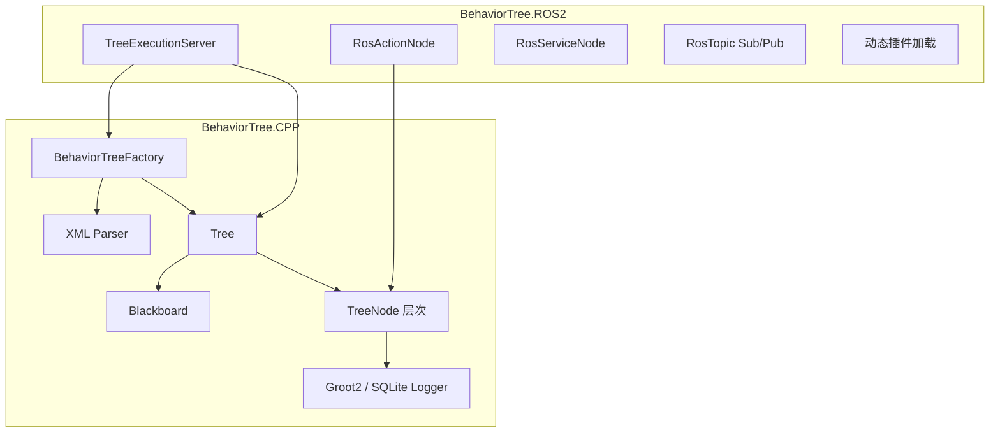

# Behavior Tree 分析总结

基于 workspace 中的 **BehaviorTree.CPP** 和 **BehaviorTree.ROS2** 两个项目，从「要解决的问题 → 核心原理 → 代码架构」三个层面说明。

---

## 一、Behavior Tree 要解决的问题

### 1. 复杂决策逻辑的可维护性

机器人、游戏 AI 等系统需要持续回答：**当前该做什么？条件变了怎么办？失败了怎么恢复？**

传统 **有限状态机（FSM）** 在状态/转移变多时会变成「意大利面条图」——每加一种情况就要改大量转移边，难以复用和测试。

Behavior Tree（行为树）用 **树形组合结构** 表达逻辑：

- **做什么** → Action 节点
- **是否满足** → Condition 节点
- **怎么组合** → Control / Decorator 节点

逻辑是 **声明式、可组合、可嵌套** 的，比 FSM 更易扩展和可视化（配合 Groot2 编辑器）。

### 2. 异步、非阻塞执行

机器人里大量操作是 **长时间异步** 的（导航、抓取、ROS Action 等）。BehaviorTree.CPP 把 **异步 Action** 作为一等公民，Action 可以返回 `RUNNING`，下次 tick 再继续，而不是阻塞整个决策循环。

### 3. 运行时灵活配置

树结构用 **XML 描述**，可在部署时加载，不必把决策逻辑硬编码进 C++。节点可 **静态注册** 或 **插件动态加载**，便于不同任务复用同一套节点库。

### 4. 与 ROS2 的集成（本 workspace 的扩展）

`BehaviorTree.ROS2` 进一步解决：如何把 BT 节点与 ROS2 的 Action / Service / Topic **非阻塞地** 对接，并提供一个标准的 **Tree 执行服务器**（类似 Nav2 的模式）。

---

## 二、核心原理

### 1. 树 + Tick 驱动

行为树不是「跑完就结束」的脚本，而是 **周期性被 tick（驱动）** 的：

```cpp
// To "execute" a Tree you need to "tick" it.
// The tick is propagated to the children based on the logic of the tree.
tree.tickWhileRunning();
```

每次 tick 从根节点向下传播；Control 节点根据子节点返回值决定下一步。

### 2. 五种节点状态

```cpp
enum class NodeStatus
{
  IDLE = 0,
  RUNNING = 1,
  SUCCESS = 2,
  FAILURE = 3,
  SKIPPED = 4,
};
```

| 状态 | 含义 |
|------|------|
| `IDLE` | 尚未执行或已 reset |
| `RUNNING` | 进行中（异步 Action 常用） |
| `SUCCESS` | 成功完成 |
| `FAILURE` | 失败 |
| `SKIPPED` | 被跳过（不算失败） |

自定义叶子节点 **不应返回 IDLE**；Control 节点根据子节点状态决定自身返回什么。

### 3. 执行入口：`executeTick()`

每个节点的统一入口是 `executeTick()`，而不是直接调 `tick()`。流程：

**前置条件 → 可选回调 → 实际 `tick()` → 后置条件 → 更新状态**

XML 上的 `_skipIf`、`_while` 等前置条件在这里生效。

### 4. 典型 Control 节点语义

**Sequence（顺序）**：子节点依次执行，任一 `FAILURE` 则整体失败；遇到 `RUNNING` 则暂停等待。

**Fallback（选择/回退）**：从左到右试，第一个 `SUCCESS` 即成功；全失败则 `FAILURE`（类似 if-else 链 / 异常处理）。

**ReactiveSequence**：每个 tick **从头重新 tick 所有子节点**，适合高优先级条件监控（如电池低则中断当前任务）。

**Parallel**：多个子树并行 tick，按策略汇总结果。

### 5. 异步 Action 的三种模式

| 类型 | 特点 |
|------|------|
| `SyncActionNode` | 同步，不能返回 RUNNING |
| `StatefulActionNode` | 推荐；`onStart()` / `onRunning()` / `onHalted()` 状态机式异步 |
| `ThreadedAction` | 独立线程执行，需处理 halt |

ROS2 的 `RosActionNode` 基于 `StatefulActionNode`，在 tick 间发 goal、轮询结果，保持 **非阻塞**。

### 6. Blackboard（黑板）数据流

节点间通过 **类型安全的 Port + Blackboard** 交换数据。XML 里 `{port_name}` 映射到 blackboard 键；支持父子 blackboard 作用域（SubTree 可隔离/传递数据）。

### 7. 示例：CrossDoor 决策逻辑

```xml
<root BTCPP_format="4">
  <BehaviorTree ID="CrossDoor">
    <Sequence>
      <Fallback>
        <Inverter>
          <IsDoorClosed/>
        </Inverter>
        <SubTree ID="DoorClosed"/>
      </Fallback>
      <PassThroughDoor/>
    </Sequence>
  </BehaviorTree>
</root>
```

语义：

1. 若门已开（`IsDoorClosed` 取反成功）→ Fallback 直接 SUCCESS，跳过开门子树
2. 若门关 → 执行 `DoorClosed` 子树开门
3. 然后 `PassThroughDoor` 穿门

这是典型的 **组合 + 复用 SubTree** 模式。

---

## 三、Workspace 中的架构

整体分两层：



### 1. BehaviorTree.CPP（核心库）

#### 节点类型体系

```cpp
enum class NodeType
{
  UNDEFINED = 0,
  ACTION,
  CONDITION,
  CONTROL,
  DECORATOR,
  SUBTREE
};
```

继承关系大致为：

```
TreeNode（抽象基类）
├── LeafNode
│   ├── ActionNodeBase → SyncActionNode / StatefulActionNode / ThreadedAction
│   └── ConditionNode
├── ControlNode → Sequence, Fallback, Parallel, ReactiveSequence, Switch, IfThenElse...
├── DecoratorNode → Retry, Timeout, Inverter, SubTree...
└── SubTreeNode
```

#### 关键组件

| 组件 | 职责 |
|------|------|
| `BehaviorTreeFactory` | 注册节点、解析 XML、创建 `Tree` |
| `Tree` | 持有节点实例；提供 `tickOnce()` / `tickWhileRunning()` |
| `Blackboard` | 跨节点共享数据 |
| `NodeConfig` | 每个节点的 ports、前置/后置条件、路径 |
| `xml_parsing.cpp` | 从 XML 构建树 |
| `scripting/` | 内嵌脚本语言（条件表达式） |
| `loggers/` | Groot2 实时监控、SQLite 回放 |

#### 源码布局

```
BehaviorTree.CPP/
├── include/behaviortree_cpp/   # 公共 API
├── src/
│   ├── controls/               # Sequence, Fallback, Parallel...
│   ├── decorators/             # Retry, Timeout, SubTree...
│   ├── actions/                # 内置 Action
│   └── loggers/                # 日志基础设施
└── examples/                   # 教程示例
```

#### 生命周期

1. **编译期/启动时**：注册 C++ 节点 → Factory
2. **部署时**：`createTreeFromFile/Text(xml)` 实例化树
3. **运行时**：循环 `tree.tickWhileRunning()` 或 `tickOnce()`
4. **销毁**：`Tree` 析构时释放所有节点

### 2. BehaviorTree.ROS2（ROS2 集成层）

包结构：

| 包 | 作用 |
|----|------|
| `behaviortree_ros2` | 核心 wrapper + `TreeExecutionServer` |
| `btcpp_ros2_interfaces` | `ExecuteTree` Action、`GetTrees` Service 等 |
| `btcpp_ros2_samples` | 示例节点与 XML |

#### TreeExecutionServer

职责：

- 通过 ROS2 Action 接收「执行哪棵树」的请求
- 加载插件与 XML
- 在独立线程中 tick 树
- 支持 cancel、Groot2 可视化、`get_loaded_trees` 服务

#### ROS 行为 Wrapper

- `RosActionNode<ActionT>`：封装 `rclcpp_action::Client`，非阻塞发 goal / 等结果
- `RosServiceNode`：Service 客户端
- `RosTopicSubNode` / `RosTopicPubNode`：Topic 订阅/发布

设计目标：**减少样板代码，让异步 Action 不阻塞 BT tick 循环**。

---

## 四、与 FSM 的对比（为何选 BT）

| 维度 | FSM | Behavior Tree |
|------|-----|---------------|
| 结构 | 扁平状态 + 转移边 | 层次化树形组合 |
| 复用 | 难（状态间耦合） | SubTree、Decorator 易复用 |
| 并发/反应式 | 需额外设计 | ReactiveSequence / Parallel 内置 |
| 可视化 | 状态图易爆炸 | Groot2 树形编辑 |
| 异步 | 需手动管理 | RUNNING + StatefulAction 原生支持 |
| 配置 | 常硬编码 | XML 运行时加载 |

---

## 五、一次完整执行流程（ROS2 场景）

```
1. 客户端发送 ExecuteTree Action Goal（指定 tree_name）
2. TreeExecutionServer 用 Factory 从 XML 创建 Tree
3. 注册/加载的插件提供具体节点（如 SleepAction、SetBool）
4. 循环 tickWhileRunning：
   - 根 Sequence tick 子节点
   - RosActionNode 若 goal 进行中 → 返回 RUNNING
   - 下次 tick 继续 onRunning()
5. 根节点 SUCCESS/FAILURE → Action 返回结果
6. Groot2Publisher 实时推送节点状态
```

---

## 六、具体例子：CrossDoor 穿门任务

下面用 workspace 里自带的 **CrossDoor（穿门）** 例子，从「树长什么样 → 节点做什么 → 每次 tick 怎么跑」讲清楚 Behavior Tree 的实际工作方式。

来源：`BehaviorTree.CPP/examples/t05_crossdoor.cpp`

### 1. 行为树长什么样

```xml
<BehaviorTree ID="MainTree">
  <Sequence>
    <Fallback>
      <Inverter>
        <IsDoorClosed/>          <!-- 条件：门是否关着？ -->
      </Inverter>
      <SubTree ID="DoorClosed"/>  <!-- 门关着才执行：开门子树 -->
    </Fallback>
    <PassThroughDoor/>            <!-- 穿门 -->
  </Sequence>
</BehaviorTree>

<BehaviorTree ID="DoorClosed">
  <Fallback>
    <OpenDoor/>                   <!-- 先试：正常开门 -->
    <RetryUntilSuccessful num_attempts="5">
      <PickLock/>                 <!-- 失败则撬锁，最多 5 次 -->
    </RetryUntilSuccessful>
    <SmashDoor/>                  <!-- 还不行就砸门 -->
  </Fallback>
</BehaviorTree>
```

用自然语言描述就是：

> **顺序执行**：先确保门是开的（没开就开门），再穿门。
> **开门策略**：先正常开 → 不行就撬锁（重试） → 再不行就砸门。

树形结构：

```
Sequence
├── Fallback                    ← 「门已开？否则开门」
│   ├── Inverter
│   │   └── IsDoorClosed
│   └── SubTree: DoorClosed
│       └── Fallback            ← 「开门三选一」
│           ├── OpenDoor
│           ├── Retry(5) → PickLock
│           └── SmashDoor
└── PassThroughDoor
```

### 2. 各节点对应的 C++ 逻辑

初始状态（`crossdoor_nodes.h`）：

- `_door_open = false`（门关着）
- `_door_locked = true`（门上锁）
- `_pick_attempts = 0`

| 节点 | 行为 |
|------|------|
| `IsDoorClosed` | 门关 → `SUCCESS`；门开 → `FAILURE` |
| `Inverter` | 子节点结果取反 |
| `OpenDoor` | 没锁 → 开门 `SUCCESS`；有锁 → `FAILURE` |
| `PickLock` | 多次尝试，第 5 次成功撬开 |
| `SmashDoor` | 强制开门，永远 `SUCCESS` |
| `PassThroughDoor` | 门开 → `SUCCESS`；门关 → `FAILURE` |

### 3. 它是如何工作的：Tick 逐步推演

行为树靠 **周期性 tick** 驱动：`tree.tickWhileRunning()` 循环调用，直到根节点返回 `SUCCESS` 或 `FAILURE`（不再是 `RUNNING`）。

每次 tick 从根节点 `Sequence` 开始，**向下传播**；Control 节点根据子节点返回值决定下一步。

#### 场景 A：初始状态（门关、上锁）——完整走一遍

**第 1 次 tick（根 Sequence）**

```
Sequence [RUNNING, 正在执行第 1 个子节点 Fallback]
  │
  ├─ Fallback 第 1 个孩子：Inverter
  │    └─ IsDoorClosed → SUCCESS（门关着）
  │    └─ Inverter 取反 → FAILURE
  │
  ├─ Fallback 第 2 个孩子：SubTree DoorClosed
  │    └─ OpenDoor → FAILURE（门上锁，开不了）
  │    └─ Retry(PickLock) 第 1 次 → PickLock → FAILURE
  │
  └─ Fallback 还在 RUNNING（Retry 会继续试）
```

此时整棵树返回 **RUNNING**（Retry 还没试完），下次 tick 继续。

**后续 tick（Retry 继续撬锁）**

```
Retry 第 2、3、4 次 PickLock → 都 FAILURE
Retry 第 5 次 PickLock → SUCCESS（撬开，_door_open=true）
  → DoorClosed 的 Fallback → SUCCESS
  → 外层 Fallback → SUCCESS
```

**下一次 tick（Sequence 第 2 个孩子）**

```
Sequence 继续执行 PassThroughDoor
  └─ _door_open=true → SUCCESS
  → Sequence → SUCCESS ✅ 任务完成
```

#### 场景 B：门本来就没锁（只关着，没锁）

```
Fallback → SubTree DoorClosed
  └─ OpenDoor → SUCCESS（直接打开）
  → 不执行 PickLock / SmashDoor
PassThroughDoor → SUCCESS ✅
```

Fallback 的特性：**第一个 SUCCESS 就停**，后面的兄弟节点不会再 tick。

#### 场景 C：门本来就是开的

```
Inverter
  └─ IsDoorClosed → FAILURE（门开着，不算「关着」）
  └─ Inverter 取反 → SUCCESS
→ Fallback 直接 SUCCESS，跳过整个 DoorClosed 子树
PassThroughDoor → SUCCESS ✅
```

这是 **「条件满足就跳过整段子逻辑」** 的典型用法。

### 4. 关键机制图解

#### Sequence：顺序执行，遇 RUNNING 暂停

```
子1 SUCCESS → 子2 SUCCESS → ... → 全部 SUCCESS 才 SUCCESS
任一 FAILURE → 立刻 FAILURE，重置所有子节点
遇 RUNNING   → 暂停，下次 tick 从这里继续
```

#### Fallback：从左到右试，第一个 SUCCESS 就赢

```
子1 SUCCESS → 立刻 SUCCESS（后面不执行）
子1 FAILURE → 试子2
子1 RUNNING → 暂停等待
全部 FAILURE → 整体 FAILURE
```

#### Inverter + Condition：把「门开着」变成「可以跳过开门」

```
IsDoorClosed: 门关 SUCCESS / 门开 FAILURE
Inverter 取反:  门开 SUCCESS / 门关 FAILURE
→ Fallback 第一个孩子就 SUCCESS → 跳过 SubTree
```

#### RetryUntilSuccessful：Decorator 包一层重试

```
子节点 FAILURE → 再 tick 一次（最多 num_attempts 次）
子节点 SUCCESS → Decorator SUCCESS
次数用尽仍 FAILURE → Decorator FAILURE
```

### 5. ROS2 异步例子：SleepAction（补充）

`BehaviorTree.ROS2` 的 `sleep_action.xml` 展示了 **异步 Action 不阻塞 tick 循环**：

```xml
<SleepAction name="sleepA" action_name="sleep_service" msec="2000"/>
```

`SleepAction` 继承 `RosActionNode`，每次 tick 的状态机大致是：

| tick 次数 | 节点状态 | 发生什么 |
|-----------|----------|----------|
| 第 1 次 | IDLE → RUNNING | `setGoal()` 发 ROS Action goal |
| 第 2~N 次 | RUNNING | 等 result，返回 RUNNING，**不阻塞**其他节点 |
| 收到 result | RUNNING → SUCCESS | `onResultReceived()` 返回 SUCCESS |

对应代码逻辑（`bt_action_node.hpp`）：

```cpp
if(status() == BT::NodeStatus::IDLE) {
  setStatus(RUNNING);
  setGoal(goal);
  sendGoal(...);   // 异步发送
  return RUNNING;  // 立刻返回，不等待
}
// 后续 tick：检查 result 是否到达
if(result_ready) return onResultReceived(result);
return RUNNING;
```

所以 sleep 2 秒期间，BT 主循环每 10ms 左右 tick 一次，树整体处于 RUNNING，但 **线程不会被 sleep 卡死**——这正是 BT 在 ROS2 里的核心价值。

### 6. 和「普通 if-else 代码」的对比

等价的 imperative 写法大概是：

```cpp
if (!door_open) {
  if (!openDoor()) {
    for (int i = 0; i < 5; i++) {
      if (pickLock()) break;
    }
    if (!door_open) smashDoor();
  }
}
if (!passThroughDoor()) return FAILURE;
```

行为树版本的优势：

1. **结构可视化**：XML + Groot2 直接看树形逻辑
2. **可组合复用**：`DoorClosed` 子树可在别的任务里复用
3. **可中断/可反应**：配合 `ReactiveSequence`、`_while` 等，条件变化时可 halt 子节点
4. **异步原生支持**：`RUNNING` 状态 + 周期性 tick，适合 ROS Action

---

## 总结

**Behavior Tree 解决的核心问题**：把「复杂、可中断、可恢复、可反应」的决策逻辑，从难以维护的 FSM/硬编码中抽离出来，用 **可组合的树 + 周期性 tick + 明确的状态语义** 表达。

**本 workspace 的实现**：

- **BehaviorTree.CPP** 提供引擎：节点体系、Factory、Blackboard、XML、异步 Action、日志
- **BehaviorTree.ROS2** 在 ROS2 上提供标准执行框架和 Action/Service/Topic 封装，面向 Nav2 类导航/任务编排场景
